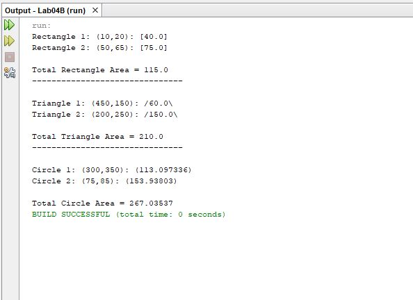
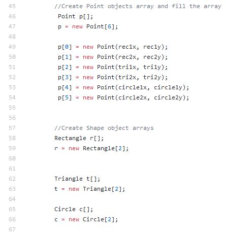
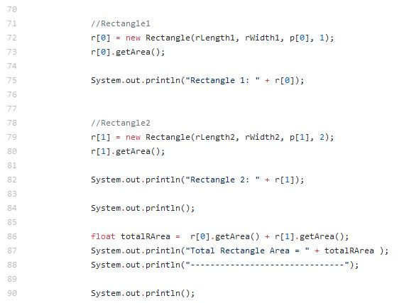

<html>
  

<body>
  
  
  
  
 <h1>A BRIEF OVERVIEW</h1>
 

  My Simple-Polygons project is a Java program that I created using the NetBeans IDE. This program creates three
  types of polygons. Instead of getting input from the user, I hard coded the information for each of the objects
	into the main class. The program includes five class files. Three of the class files represent each polygon object that can 
  be created. These files are Rectangle, Triangle, and Circle. There is also a class file titled Point. This class creates 
  a "Point" object that 'points' to the x-coordinate and y-coordinate of a created polygon object. The coordinates are 
  based on a two-dimensional plane. Of course, one class file titled Lab04B contains the main class. This main class initiates 
  several variables, arrays, creates objects, and produces output to the screen.

  
  
 
  
<h1>CLASS FILES</h1>
 
 
<h2>Rectangle, Triangle, and Circle Class File</h2>
		

   I began these files by creating instance fields. After the instance fields,
   I created constructors that receive the arguments from the main method and create the objects.
   I then created getter methods that return the characteristics of the polygons. The 'area' getter
   method is used to compute the area of the polygon and return it. The getPoint method returns the location
   of the object. The 'getLayer' method returns which position in the layer of the created objects a particular object lies.
   I also used a 'toString' method that allowed me to format the output as shown below:

	
			 
   
 

<h2>Point Class File</h2>
	

		This file is very simple. I started this file by declaring instance fields for the x and y coordinates. I then included
		a constructor and two getter methods to return the values of x and y.
	

<h2>Main Class File</h2>

   I began this file by declaring variables for the Point objects and variables for the shape objects. These variables
   serve as the arguments used in the constructors and method calls for each object. 

I then created an array for every type of object. Doing this allowed me to hold multiples of each type of object.

 

	 Next, I created new objects to fill the arrays. As mentioned earlier, I used the declared variables to serve as the
   arguments to the objects' constructors and method calls.  I also used the Point objects as arguments to assign coordinates
   to each shape, and I hard coded a number that serves as the objects position in the layer. After the objects were created, 
   I called the getArea methods to compute the area of each object. The program then prints the object's area, coordinates, 
   and position in the layer to the screen. Each object is printed according to the toString methods in each object class. I
   then added the areas of each alike objects together and printed the total areas to the screen. I did this for each type of 
   polygon object.
   
   Below is the rectangle portion of this code:
 

 

		
<h1>WHAT DID I LEARN?</h1>

	<ul>
		<li>How to initialize and create an array</li>
		<li>How to use objects as instance fields for other objects</li>
		<li>How to use a toString method to format the output of objects to the screen</li>
		<li>How to use objects as arguments</li>
		<li>How to call methods of other classes</li>
	</ul>
	
	

	
 
 
 
 
</body>
  

  </html>
